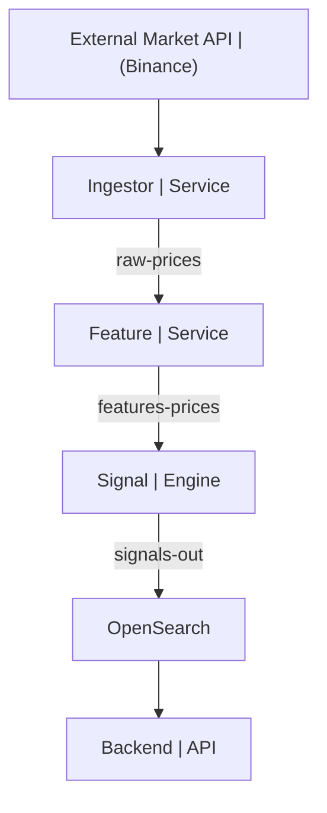

# QuantPlatform

A real-time streaming architecture for ingesting market prices, computing quantitative indicators, generating trading signals, and indexing them into OpenSearch for fast retrieval and analysis.  
This project is designed as a full end-to-end system that demonstrates practical knowledge of microservices, event-driven architectures, Kafka, quantitative finance features, and search-optimized storage.

---

## Overview

QuantPlatform consists of four independent Spring Boot microservices communicating through Kafka:

### 1. Ingestor Service
Retrieves live market prices from an external provider (Binance API) and publishes raw price messages to Kafka.

### 2. Feature Service
Consumes raw prices, maintains a rolling price history, and computes multiple quantitative indicators (SMA, EMA, volatility, returns, RSI).  
Outputs enriched feature messages back to Kafka.

### 3. Signal Engine
Consumes feature messages and applies simple rule-based logic to decide whether to emit BUY, SELL, or HOLD trading signals.  
Produces those signals into a dedicated Kafka topic.

### 4. Backend API
Consumes trading signals and indexes them into OpenSearch.  
Exposes REST endpoints for querying signals by:
- latest N signals  
- by symbol  
- by signal type  

A React frontend can later be added to visualize the indexed data.

---

## Technologies Used

### Core
- Java 22  
- Spring Boot 3  
- Kafka (Confluent images)  
- OpenSearch 2.x
### Deployment / Infrastructure
- Docker Compose for Kafka, Zookeeper, OpenSearch, Dashboards  

---

## Architecture

---

## Running the System

### 1. Start infrastructure

```bash
docker compose up -d
```

---

### 2. Start all services

In project root, from different terminals:

```bash
./mvnw -pl ingestor spring-boot:run
./mvnw -pl feature-service spring-boot:run
./mvnw -pl signal-engine spring-boot:run
./mvnw -pl backend spring-boot:run
```

---

### 3. Query the REST API  
(Add `| jq` at the end to format the JSON output)

```bash
curl http://localhost:8080/api/signals/latest
curl http://localhost:8080/api/signals/symbol/BTCUSDT
curl http://localhost:8080/api/signals/type/BUY
```

